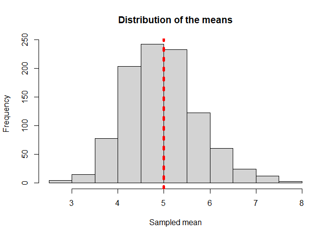
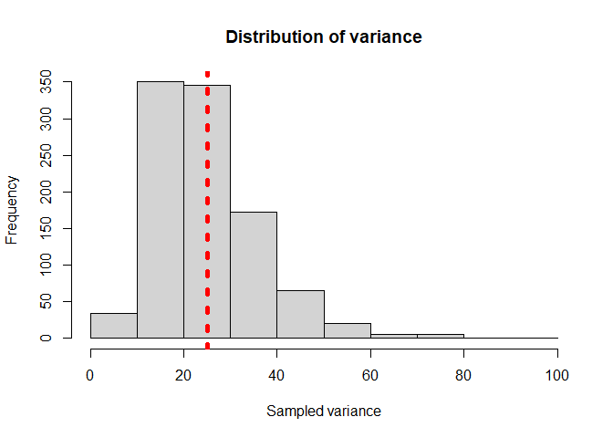
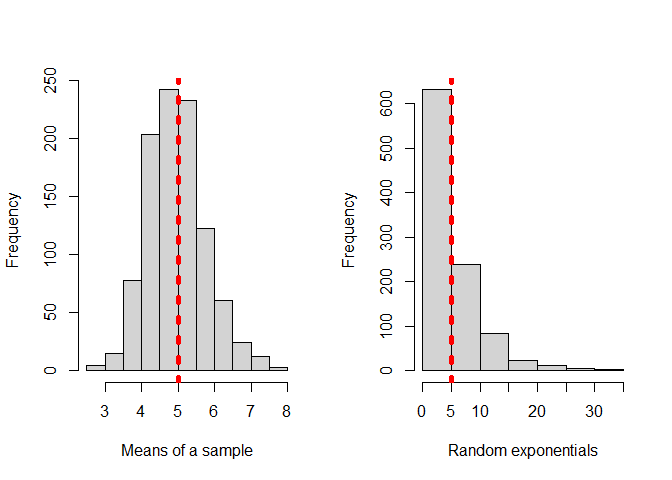

---

# Overview

We are going to simulate here 1000 samples of size 40 from a exponential distribution. Then we are going to compare it with the theoretical mean, variance and distribution.

---

# Simulation

First we need to set the sample size to be simulated and the theoretical mean, which is also equal to the theoretical standard deviation, of the exponential distribution, which is 1/lambda, and the variance. Lambda is called the rate of the distribution.


```r
n <- 40
lambda <- 0.2
mu0 <- 1/lambda
variance <- mu0^2
```

Now we are going to simulate 1000 exponential samples of size 40, take the mean and standard deviation of each sample and store those values for further analysis. 


```r
simulation <- data.frame()
for(i in 1:1000){
        sample <- rexp(n, lambda)
        simulation <- rbind(
                c(avg = mean(sample), variance = sd(sample)^2),
                simulation
                )
}
```

---

# Sample mean versus theoretical mean

First, we take a look at the distribution of the means from the simulation, with the theoretical mean in red.


```r
hist(simulation[,1],main = 'Distribution of the means',xlab = 'Sampled mean')
abline(v = mu0,col = 'red', lwd = 5,lty = 3)
```

<!-- -->

We can see that the simulated mean distribution in fact does look well centered around the theoretical mean. 

To confirm this, we need more than just a graph, we need a relevant confidence test.

We have the following alternative hypothesis:

* Is the sampled mean different from the theoretical mean at a 5% significance level?


```r
t.test(x = simulation[,1],
       alternative = 'two.sided',
       mu = mu0,
       conf.level = .95)
```

```
## 
## 	One Sample t-test
## 
## data:  simulation[, 1]
## t = -1.804, df = 999, p-value = 0.07153
## alternative hypothesis: true mean is not equal to 5
## 95 percent confidence interval:
##  4.904581 5.004010
## sample estimates:
## mean of x 
##  4.954296
```

From this test we **can't reject** the null hypothesis that the sampled means are equal to the theoretical mean in favor of the alternative hypothesis.

---

# Sample Variance versus theoretical variance

Let's look at the distribution for the variance, with the theoretical variance in red.


```r
hist(simulation[,2],main = 'Distribution of variance',xlab = 'Sampled variance')
abline(v = variance, col = 'red', lwd = 5,lty = 3)
```

<!-- -->

It looks well centered around the theoretical variance too.

To confirm this, we need more than just a graph, we need a relevant confidence test.

We have the following alternative hypothesis:

* Is the sampled variance different from the theoretical variance at a 5% significance level?


```r
t.test(x = simulation[,2],
       alternative = 'two.sided',
       mu = variance,
       conf.level = .95)
```

```
## 
## 	One Sample t-test
## 
## data:  simulation[, 2]
## t = -0.068636, df = 999, p-value = 0.9453
## alternative hypothesis: true mean is not equal to 25
## 95 percent confidence interval:
##  24.26881 25.68177
## sample estimates:
## mean of x 
##  24.97529
```

From this test we **can't reject** the null hypothesis that the sampled variances are equal to the theoretical variance in favor of the alternative hypothesis. 

---

# Distribution

At last, let's compare the simulated sample means with a exponential distribution of 1000 random exponentials made with the same theoretical mean.


```r
par(mfrow = c(1,2))
hist(simulation[,1],xlab = 'Means of a sample',main ='')
abline(v = mu0, col = 'red', lwd = 5,lty = 3)
hist(rexp(1000,lambda),xlab = 'Random exponentials',main = '')
abline(v = mu0, col = 'red', lwd = 5,lty = 3)
```

<!-- -->

One can tell a distribution is approximately normal when the distribution has a bell curve, it's centered around its true mean and it's not too skewed.

We can see that, even though the 1000 exponential distribution does not look approximately normal, the distribution of 1000 averages from samples from the exponential distribution does, as it is stated at the Central Limit Theorem.


